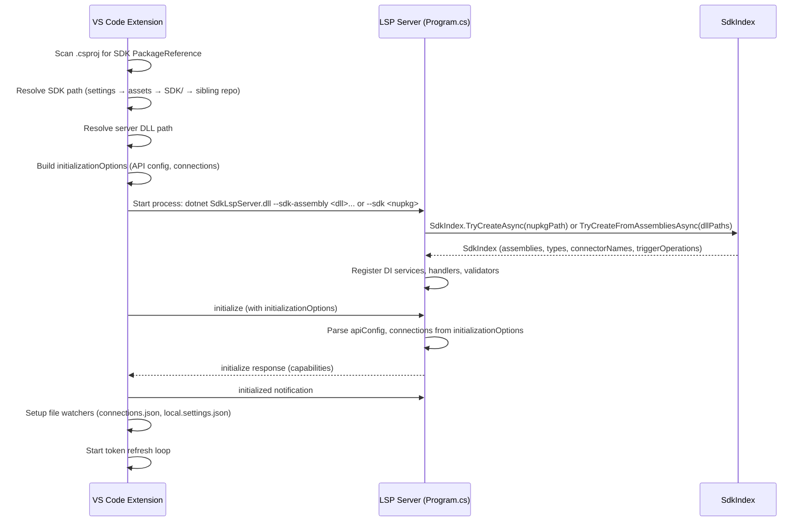
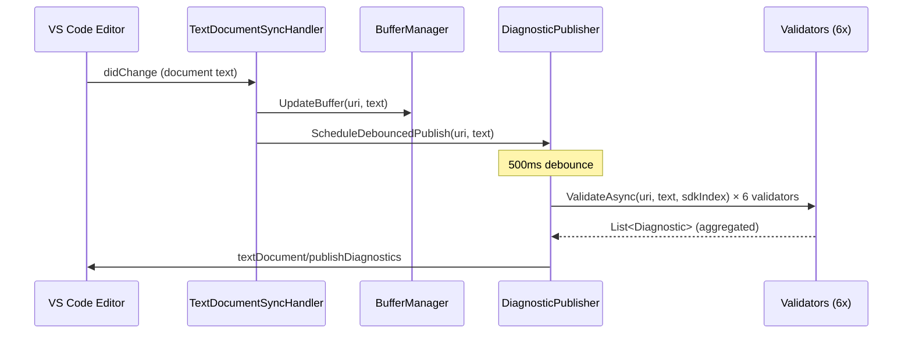
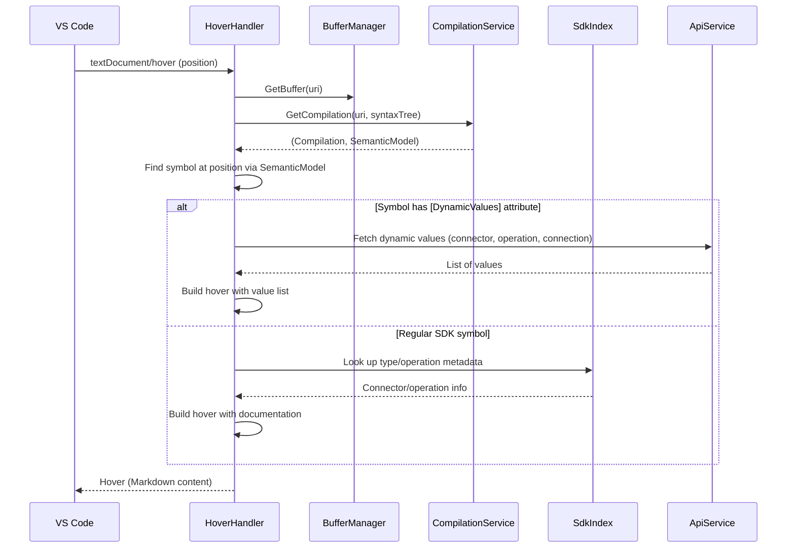
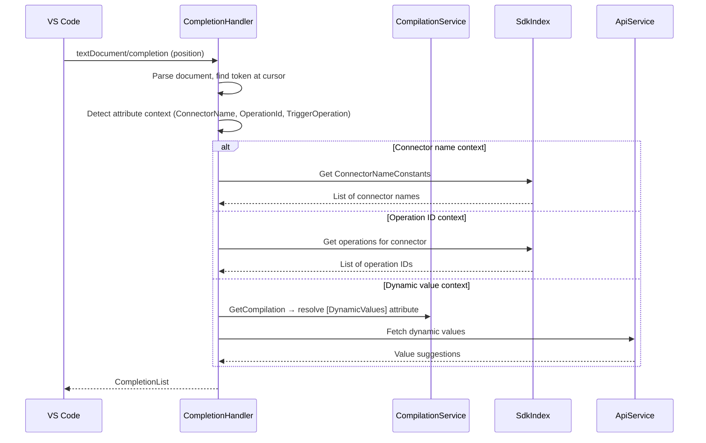
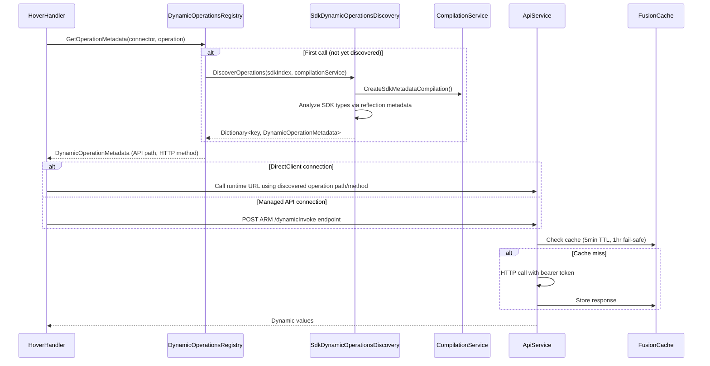

# Architecture Overview

This document describes the architecture of the Connectors SDK LSP server and VS Code extension. It is intended for developers contributing to or extending the project.

## Component Map

The system has two main parts: a **VS Code extension** (TypeScript) that manages lifecycle and configuration, and an **LSP server** (C#/.NET 8) that performs code analysis.

### VS Code Extension (`vscode-extension/src/extension.ts`)

The extension is the entry point. On activation it:

1. **Scans for SDK references** — reads `.csproj` files to check for `PackageReference` to the Connector SDK. If no reference is found and no explicit `lspServerPath` is configured, the extension stays inactive.
2. **Resolves the SDK path** — a 4-step fallback chain (see [SDK Discovery Chain](#adr-4-sdk-discovery-chain) below).
3. **Resolves the server DLL** — checks explicit setting → sibling debug build → bundled `server/` directory.
4. **Builds `initializationOptions`** — merges API config (Azure subscription, resource group, bearer token) and connections (from `connections.json` and `local.settings.json`) into a JSON payload. (The server also accepts CodeLens and telemetry config in `initializationOptions`, but the VS Code extension does not currently send those.)
5. **Starts the LSP server** via `dotnet <server.dll>` over stdio transport, passing `--sdk-assembly <dll>...` when SDK resolution returns DLL paths (from explicit `.dll` setting or `project.assets.json`), or `--sdk <nupkg>` when resolution returns a `.nupkg` file.
6. **Sets up file watchers** — watches `connections.json` and `local.settings.json` for changes; sends merged updates to the server via the `custom/updateConnections` notification.
7. **Starts a token refresh loop** — periodically acquires Azure tokens and pushes them to the server via `custom/updateApiConfig`.
8. **Registers commands** — `restartLanguageServer`, `openConnectionView`, `sdklsp.applyEdits` (for click-to-insert links in hover tooltips).

### LSP Server

#### Server Core

| File | Responsibility |
|------|----------------|
| `Program.cs` | Entry point. Parses CLI args (`--sdk`, `--sdk-assembly`), creates `SdkIndex`, registers all services and handlers via DI (`Microsoft.Extensions.DependencyInjection`), wires custom notification handlers (`custom/updateApiConfig`, `custom/updateConnections`), parses `initializationOptions` on `OnInitialize`. |
| `SdkIndex.cs` | Eagerly indexes SDK assemblies at startup via `System.Reflection.Metadata`. Exposes immutable collections: `ConnectorNameConstants`, `TriggerOperationsByConnector`, `TypeNames`, and a `FrozenSet<string>` lookup for O(1) type existence checks. Created from `.nupkg` (via `NupkgLoader`) or directly from DLL paths. |
| `BufferManager.cs` | Thread-safe `ConcurrentDictionary<string, string>` mapping document URIs to their latest text content. Updated on every `didOpen`/`didChange` event. Provides `GetAllBuffers()` for re-triggering diagnostics when external state changes. |
| `NupkgLoader.cs` | Extracts `.nupkg` (ZIP) via SharpZipLib and returns discovered DLL paths. |

#### Handlers (LSP Protocol Endpoints)

| Handler | Protocol Method | What It Does |
|---------|----------------|--------------|
| `TextDocumentSyncHandler` | `didOpen`, `didChange`, `didSave`, `didClose` | Updates `BufferManager`, schedules debounced diagnostics via `DiagnosticPublisher`, requests CodeLens refresh when SDK usage is detected. (`CompilationService` cache is replaced lazily when `GetCompilation` detects a changed text length/checksum — there is no explicit invalidation call.) |
| `HoverHandler` | `textDocument/hover` | Parses the document, gets a `SemanticModel` from `CompilationService`, resolves the symbol at the cursor position, and returns rich Markdown hover content. For `[DynamicValues]` parameters, calls `DynamicOperationsRegistry` → `ApiService` to fetch live values from the connector API. |
| `CompletionHandler` | `textDocument/completion` | Detects attribute argument contexts (connector names, operation IDs, trigger operations) and returns completion items from `SdkIndex`. For dynamic value parameters, fetches suggestions via `ApiService`. |
| `CodeLensHandler` | `textDocument/codeLens` | Scans method signatures for SDK return types and attributes, and renders inline metadata (connector name, operation, HTTP method) above method declarations. Command names are configurable via `CodeLensConfig`. |
| `DynamicSchemaCodeActionHandler` | `textDocument/codeAction` | Detects `[DynamicSchema]` types at the cursor position using a pre-built cache of type→operationId mappings (built from SDK metadata at construction time). Returns a lightbulb code action — no schema fetch happens here. |
| `GenerateDynamicSchemaCommandHandler` | `workspace/executeCommand` | Executes when the user clicks the DynamicSchema code action. Fetches the JSON schema from the connector API, generates a typed C# class via `SchemaToClassGenerator`, and applies the edit. |

#### Services

| Service | Responsibility |
|---------|----------------|
| `CompilationService` | Creates and caches Roslyn `CSharpCompilation` instances per document URI. Cache key is `(textLength, contentChecksum, projectDirectory)`. References include .NET core assemblies, SDK assemblies (from `SdkIndex`), and project NuGet references (discovered from `project.assets.json`). Also provides `CreateSdkMetadataCompilation()` for metadata-only analysis. |
| `ApiService` | Makes authenticated HTTP calls to the Azure API Hub for dynamic values and schema resolution. Uses `DefaultAzureCredential` (Azure CLI) or an explicit bearer token. Responses are cached via `FusionCache` with 5-minute TTL and fail-safe (serve stale data for up to 1 hour on API failure). |
| `ConnectionsService` | Thread-safe store for the current connections configuration (managed API + DirectClient). Updated at initialization and at runtime via `custom/updateConnections` notifications. |
| `CodeLensConfig` | Holds configurable CodeLens command names, populated from `initializationOptions`. |
| `ITelemetryService` / `TelemetryService` | Application Insights integration with debug mode. Tracks events, metrics, exceptions, and dependency calls. Initialized from `initializationOptions.telemetry`. |

#### Diagnostics Pipeline

```text
TextDocumentSyncHandler
  │  (on didOpen / didChange / didSave)
  ▼
DiagnosticPublisher
  │  Debounces changes (500ms default)
  │  Runs all IDiagnosticValidator implementations
  │  Aggregates results
  ▼
textDocument/publishDiagnostics → VS Code
```

`DiagnosticPublisher` iterates over all registered `IDiagnosticValidator` instances and publishes the combined diagnostics. When connections change at runtime, the publisher re-validates all open documents.

**Registered validators** (in registration order from `Program.ConfigureServices`):

| Validator | What It Checks |
|-----------|----------------|
| `SdkUsageValidator` | General SDK usage patterns |
| `AttributeValidator` | Attribute argument validity (e.g., connector names, operation IDs against `SdkIndex`) |
| `ConnectionConfigValidator` | Whether required connections are configured for used connectors |
| `TriggerPayloadValidator` | Trigger payload type conventions |
| `DynamicValuesValidator` | `[DynamicValues]` parameter values against live API data |
| `SdkAntiPatternValidator` | Common anti-patterns in SDK usage |

See [`.github/copilot-instructions.md`](../.github/copilot-instructions.md#architecture-diagnostic-validators) for validator authoring guidelines, including the analysis strategy and key implementation details.

#### State Management (`Store/`)

`LSPStore` is a centralized state container (Redux-inspired) with three slices:

| Slice | Backing Store | Purpose |
|-------|---------------|---------|
| `DynamicDataStore` | `ConcurrentDictionary` | Caches dynamic values fetched from APIs, keyed by `{connector}:{operation}:{connectionName}`. Shared across Hover and Completion handlers to avoid duplicate API calls. 5-minute TTL. |
| `DocumentDataSlice` | `ConcurrentDictionary` | Per-document metadata (e.g., detected SDK usage patterns). |
| `SessionDataSlice` | `ConcurrentDictionary` | Generic key-value store for session-scoped data. |

## Data Flow Diagrams

### Startup



### Document Edit → Diagnostics



### Hover



### Completion



### Dynamic Values Resolution



## Analysis Strategy

The LSP server uses two levels of code analysis depending on the latency budget:

- **Syntax-only analysis** — Used by most diagnostic validators and fast-path handlers. Parses the document with `CSharpSyntaxTree.ParseText()` and walks the syntax tree without building a full compilation. This avoids the cost of reference resolution and provides sub-100ms response times.
- **Semantic model analysis** — Used by Hover, Completion, and CodeLens handlers when they need type resolution, symbol lookup, or attribute inspection. Goes through `CompilationService.GetCompilation()` to get a full Roslyn `SemanticModel` with SDK and NuGet references. Some diagnostic validators also use semantic analysis for checks that cannot be done syntactically — notably `DynamicValuesValidator` (resolves `[DynamicValues]` attribute arguments to their declared operations) and `SdkAntiPatternValidator` (inspects method symbols and return types).

For detailed validator authoring guidelines covering this strategy, see the [Architecture: Diagnostic Validators](../.github/copilot-instructions.md#architecture-diagnostic-validators) section in `.github/copilot-instructions.md`.

## Key Design Decisions

### ADR 1: MetadataReferences Instead of Assembly.Load

**Context:** The LSP server needs to analyze SDK types and their attributes without executing SDK code.

**Decision:** Use Roslyn `MetadataReference.CreateFromFile()` to load SDK assemblies as metadata references for compilation, rather than `Assembly.Load()` or `Assembly.LoadFrom()`.

**Rationale:**

- Avoids dependency loading issues — `Assembly.Load` pulls in transitive dependencies that may conflict with the server's own dependencies
- No code execution risk — metadata references are read-only views of the assembly's type system
- Compatible with Roslyn's `CSharpCompilation` — the same references are used for semantic analysis
- `SdkIndex` uses `System.Reflection.Metadata` (raw IL reading) for initial indexing, which is even lighter

### ADR 2: Singleton CompilationService with Caching

**Context:** Multiple handlers (Hover, Completion, CodeLens, Diagnostics) need Roslyn compilations for the same document.

**Decision:** A single `CompilationService` instance caches one compilation per document URI. The cache key is `(textLength, contentChecksum, projectDirectory)` — a new compilation is created only when the document text changes or a different project context is detected.

**Rationale:**

- Avoids redundant compilation creation across handlers processing the same document version
- The `ConcurrentDictionary` cache retains only the latest version per URI to bound memory
- When the caller passes a different `SyntaxTree` instance with identical text, the service replaces the tree in the cached compilation via `ReplaceSyntaxTree` (cheap operation) rather than rebuilding from scratch

### ADR 3: Syntax-Only Diagnostics

**Context:** Diagnostic validators run on every keystroke (debounced to 500ms). Full semantic analysis on each change would introduce noticeable latency.

**Decision:** Diagnostic validators primarily use syntax-tree walking. Semantic model usage is reserved for specific checks that cannot be done syntactically (e.g., resolving `[DynamicValues]` attribute arguments to their declared operations).

**Rationale:**

- Syntax parsing is ~1ms for typical files vs ~50-100ms for full compilation
- Most SDK diagnostics (attribute presence, connector name validation) can be checked syntactically by matching attribute names and string literal arguments against `SdkIndex`
- Validators that need semantic analysis (e.g., `DynamicValuesValidator` for attribute argument resolution, `SdkAntiPatternValidator` for async/await and cancellation-token checks) accept the cost for higher-value diagnostics

### ADR 4: SDK Discovery Chain

**Context:** The extension needs to find the Connector SDK assemblies to pass to the LSP server. Different development scenarios require different discovery strategies.

**Decision:** A 4-step fallback chain, tried in order:

1. **Explicit setting** — `connectorSdk.sdkPath` in VS Code settings (`.dll` or `.nupkg`)
2. **Project assets** — Parse `obj/project.assets.json` to find SDK DLLs from the NuGet package cache (the standard `dotnet restore` workflow)
3. **Workspace `SDK/` folder** — Search for the newest `.nupkg` in a workspace-level `SDK/` directory
4. **Sibling repo build output** — Look for a `.nupkg` in `../../Connectors-NET-SDK/src/.../bin/Debug` (development scenario when the SDK repo is checked out alongside)

**Rationale:**

- Step 1 provides an explicit override for non-standard setups
- Step 2 is zero-configuration for normal projects — if the user has run `dotnet restore`, the SDK DLLs are already available
- Step 3 supports manual SDK staging for evaluation or E2E testing
- Step 4 enables F5 debugging of the SDK and LSP extension side by side
- If no SDK is found and the project both references the SDK package and is missing `obj/project.assets.json` (i.e., `dotnet restore` has not been run), the extension prompts the user to restore
